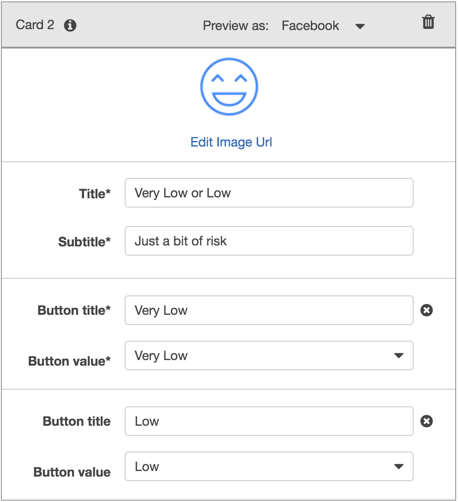

# Retirement Roboadvisor

With machine learning and NLP disrupting finance to improve customer experience, this project was built to create a robo advisor that could be used by customers or potential new customers to get investment portfolio recommendations for retirement using Slack.

This project combined Amazon Web Services with Python to create a bot that will recommend an investment portfolio for a retirement plan.

The following is a list of steps undertaken:

1. Initial Robo Advisor Configuration: Defined an Amazon Lex bot with a single intent that establishe a conversation about the requirements to suggest an investment portfolio for retirement.

2. Built and Tested the Robo Advisor: Made sure that the bot is working and responding accurately along with the conversation with the user, by building and testing it.

3. Deploy the Robo Advisor on Slack: Published the bot and created a Robo Advisor Slack app.

4. Enhanced the Robo Advisor with an Amazon Lambda Function: Created an Amazon Lambda function that validated the user's input and returned the investment portfolio recommendation. This task included testing the Amazon Lambda function and making the integration with the bot.

5. Deploy the Robo Advisor Powered by Amazon Lambda: Published a new version of the bot that included the new Amazon Lambda function, and also tested the new version of your bot on Slack.

---

#### Initial Robo Advisor Configuration

In this section, the `RoboAdvisor` bot was created and had an intent with its corresponding slots.

Signed in into own AWS Management Console and create a new custom Amazon Lex bot. Used the following parameters:

* **Bot name:** RoboAdvisor
* **Output voice**: Salli
* **Session timeout:** 5 minutes
* **COPPA**: No

Created the `RecommendPortfolio` intent, and configured some sample utterances as follows:

* I want to save money for my retirement
* I'm ​`{age}​` and I would like to invest for my retirement
* I'm `​{age}​` and I want to invest for my retirement
* I want the best option to invest for my retirement
* I'm worried about my retirement
* I want to invest for my retirement
* I would like to invest for my retirement

Moved to the *Confirmation Prompt* section, and set the following messages:

* **Confirm:** Thanks, now I will look for the best investment portfolio for you.
* **Cancel:** I will be pleased to assist you in the future.

On this bot four slots four slots were used, three using built-in types and one custom slot named `riskLevel`. Define the three initial slots as follows:

| Name             | Slot Type            | Prompt                                                                    |
| ---------------- | -------------------- | ------------------------------------------------------------------------- |
| firstName        | AMAZON.US_FIRST_NAME | Thank you for trusting on me to help, could you please give me your name? |
| age              | AMAZON.NUMBER        | How old are you?                                                          |
| investmentAmount | AMAZON.NUMBER        | How much do you want to invest?                                           |

The `riskLevel` custom slot was used to retrieve the risk level the user was willing to take on the investment portfolio; created this custom slot as follows:

* **Name:** riskLevel
* **Prompt:** What level of investment risk would you like to take?
* **Maximum number of retries:** 2
* **Prompt response cards:** 4

Configure the response cards for the `riskLevel` slot as is shown bellow:

| Card 1                              | Card 2                              |
| ----------------------------------- | ----------------------------------- |
|   |   |

| Card 3                              | Card 4                              |
| ----------------------------------- | ----------------------------------- |
|   |   |

Left the error handling configuration for the `RecommendPortfolio` bot with the default values.

#### Build and Test the Robo Advisor

In this section, the Robo Advisor was tested. Built the bot and tested it on the chatbot window. The conversation was close to the following.

#### Deploy the Robo Advisor on Slack

Now in this section, the mission was to publish the first version of the bot and configure the connection to Slack.

1. From the Amazon Lex console, published the version 1 of the `RoboAdvisor` bot.
2. Logged into the Slack API website and created a new app called `Robo Advisor` into the development Slack workspace that was previously defined.
3. Went to the Amazon Lex Console, navigated to the *Channels* tab on the `RoboAdvisor` bot configuration, and set up the Slack connection details.
4. Completed the Slack integration and tested it.

After completing these tasks, the bot was working on Slack similar to the following.

#### Enhance the Robo Advisor with an Amazon Lambda Function

In this section, created an Amazon Lambda function that would validate the data provided by the user on the Robo Advisor. Started by creating a new lambda function from scratch and named it `recommendPortfolio`. Selected Python 3.7 as runtime.

Next was completing the `recommend_portfolio()` function by following these guidelines:

##### User Input Validation

* The `age` should be greater than zero and less than 65.
* the `investment_amount` should be equals o greater than 5000.

##### Investment Portfolio Recommendation

Once the intent was fulfilled, the bot responded with an investment recommendation based on the selected risk level as follows:

* **none:** "100% bonds (AGG), 0% equities (SPY)"
* **very low:** "80% bonds (AGG), 20% equities (SPY)"
* **low:** "60% bonds (AGG), 40% equities (SPY)"
* **medium:** "40% bonds (AGG), 60% equities (SPY)"
* **high:** "20% bonds (AGG), 80% equities (SPY)"
* **very high:** "0% bonds (AGG), 100% equities (SPY)"

Once the lambda function was completed, tested it using sample test cases.

After successfully testing your code, opened the Amazon Lex Console and navigated to the `RecommendPortfolio` bot configuration, integrated the new lambda function by selecting it on the _Lambda initialization and validation_ and _Fulfillment_ sections. Built the bot, and had something similar to the following.

#### Deploy the Robo Advisor Powered by Amazon Lambda

Now the bot was ready to advise customers about retirement plans on Slack. Published a new version of the bot and tested it on Slack. The end result was something similar to the following.

## Built With

* [Python](https://www.python.org/) - Programming language.
* [AWS Lex](https://aws.amazon.com/lex/) - Conversational interfaces provided by AWS.
* [AWS Lambda](https://aws.amazon.com/lambda/) - Serverless computing platform provided by AWS.
* [Slack](https://slack.com/) - Instant messaging platform.

## Authors

* **Roberto Cantu**  - [GitHub](https://github.com/RCantu92)